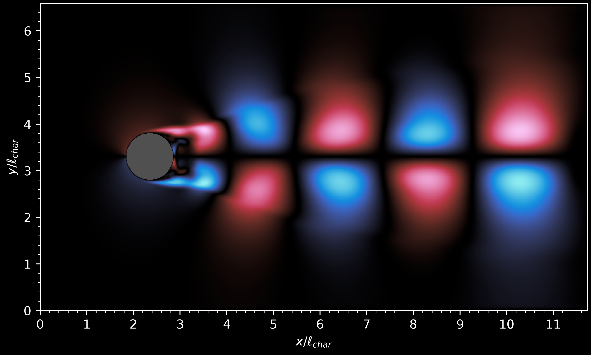
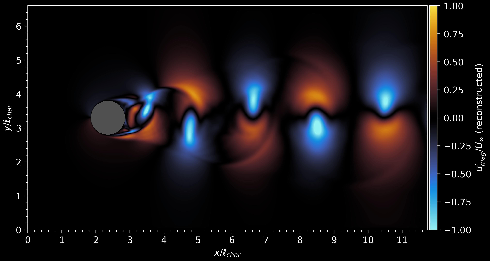

# dmd

Dynamic Mode Decomposition (DMD) Analysis

Example:

A simple dynamical system such as the numerically simulated 2D velocity field around a circular cylinder at Re=1000 (see https://github.com/iagappel/lbm)

